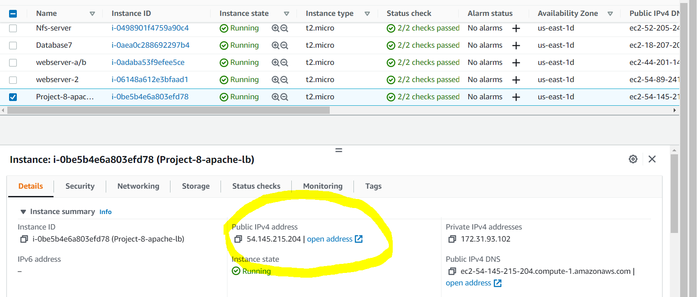

# Configure Apache As A Load Balancer

## Step 1

Create an Ubuntu Server 20.04 EC2 instance and name it Project-8-apache-lb

Open TCP port 80 on Project-8-apache-lb 

Install Apache Load Balancer on Project-8-apache-lb server and configure it to point traffic coming to LB to both Web Servers from project 7:

#Install apache2

`sudo apt update
`sudo apt install apache2 -y`

`sudo apt-get install libxml2-dev`

#Enable following modules:

`sudo a2enmod rewrite`

`sudo a2enmod proxy`

`sudo a2enmod proxy_balancer`

`sudo a2enmod proxy_http`

`sudo a2enmod headers`

`sudo a2enmod lbmethod_bytraffic`

#Restart apache2 service

`sudo systemctl restart apache2`

Make sure apache2 is up and running

`sudo systemctl status apache2`

Configure load balancing

`sudo vi /etc/apache2/sites-available/000-default.conf`

#Add this configuration into this section <VirtualHost *:80>  </VirtualHost>

<Proxy "balancer://mycluster">
               BalancerMember http://<WebServer1-Private-IP-Address>:80 loadfactor=5 timeout=1
               BalancerMember http://<WebServer2-Private-IP-Address>:80 loadfactor=5 timeout=1
               ProxySet lbmethod=bytraffic
               # ProxySet lbmethod=byrequests
        </Proxy>

        ProxyPreserveHost On
        ProxyPass / balancer://mycluster/
        ProxyPassReverse / balancer://mycluster/

#Restart apache server

`sudo systemctl restart apache2`

Verify that our configuration works – try to access your LB’s public IP address or Public DNS name from your browser:
http://<Load-Balancer-Public-IP-Address-or-Public-DNS-Name>/index.php

